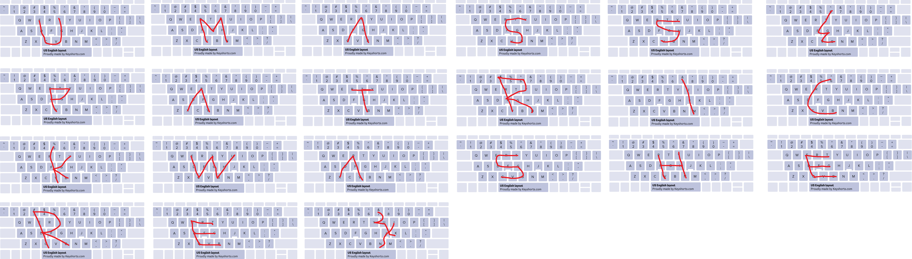

# Agent P

> Patrick sees secret, he puts it into computer immediately. But can you read the flag?

We are given with the challenge file: `secret.tar.gz`

It only contains one file, which is `a.txt`

```
	EDCVGT VFRGYHN CFTGB YTRFGBV YTRFGHBV 6TFGVB FGYTRFV XDRFV RTYTGB 4RFV456YTFGN 7UJM 65RDCVB 5RFVYGGB EDCFTGBHU XDRFV TREDFGBVC RFVFGHYHN ERTDFGCVBEDC 3EDC345TFDFB EDCERTDFGCVB 7YUJKIJN
```

For some reason, my instinct kicked in to look at my keyboard.

Following the trail of EDCVGT and VFRGYHN, it formed U and M! Come to think of it, those are weirdly placed letters as well and it does make sense.

Grabbed an image of a keyboard and drew there instead.



Whew! (the end brace tho haha, can't draw it correctly)

Flag: `UMASS{PATRICKWASHERE}`