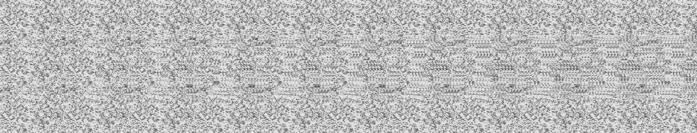
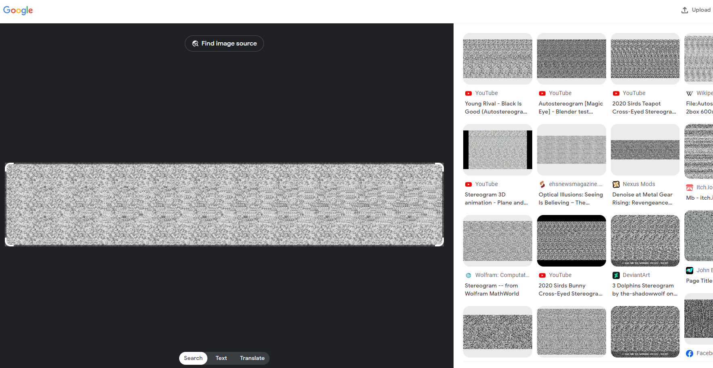
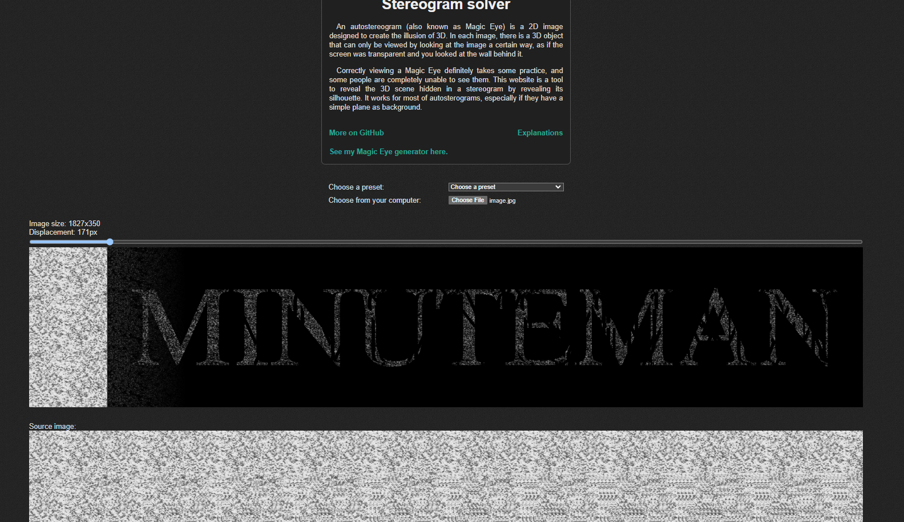

# Magic The Ungathering

> I took 2 much red40 while watchmaxxing spongebob and I forgor to write a welcome challenge. Now all I can see is this image burned into my retinas. WHAT DOES IT MEAN!?! (There is a word in this image, wrap it in UMASS{} to get the flag. Example: if the word was ALLIGATOR the flag would be UMASS{ALLIGATOR})

Solution:

We are provided with one image file: `image.jpg`

I tried to squint my eye but no luck. Decided to use https://images.google.com/ and see if there are any similar images out there.

Ohh, Stereogram! 

Searched for a solver and ended at https://piellardj.github.io/stereogram-solver/
> An autostereogram (also known as Magic Eye) is a 2D image designed to create the illusion of 3D. In each image, there is a 3D object that can only be viewed by looking at the image a certain way, as if the screen was transparent and you looked at the wall behind it.

Heh, there's the "Magic Eye", so the "Magic" and "retinas" were hints after all.

There we go!

Flag: `UMASS{MINUTEMAN}`