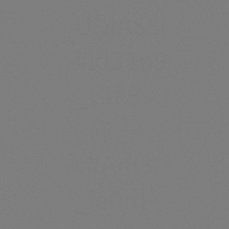
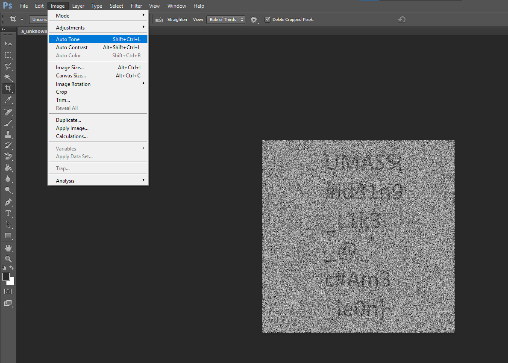

# Stop the voices

> Patrick’s been trying to remember the flag, but his vision seems a little blurry and the voices just don't stop...

Solution:

We are given with a ZIP archive file that contains the following:
- `samples` folder that contains 400 PNG images
- `generator.py`

```python
from PIL import Image
import numpy as np

img = Image.open('FLAG.png').convert('L')
arr = np.asanyarray(img)


def normalize(mat):
    return (mat - mat.min()) / (mat.max() - mat.min()) * 255


for i in range(400):
    noise = np.random.normal(arr, 200)
    noise = normalize(noise)
    noise = noise.astype(np.uint8)
    im = Image.fromarray(noise)
    im.save(f"./samples/{i}.png")
```

To solve this challenge, we need to reverse the image processing operations applied to the original image, which are essentially adding noise and normalizing. 

Since the added noise is randomly generated with a Gaussian distribution centered on the values of the original image, the most direct way to estimate the original image is by averaging all the noisy images. 

The average should converge towards the original image values because the random noise should cancel itself out over many samples.

```python
from PIL import Image
import numpy as np
import os

def loadImages(folder):
    images = []
    for filename in os.listdir(folder):
        img = Image.open(os.path.join(folder, filename)).convert('L')
        if img is not None:
            images.append(np.array(img))
    return images

def averageImages(images):
    allImages = np.stack(images, axis=0) # Stack images along a new dimension
    meanImage = np.mean(allImages, axis=0) # Calculate the mean along the stack dimension
    return meanImage

folderPath = './samples'
images = loadImages(folderPath)

meanImageArray = averageImages(images)

meanImage = Image.fromarray(meanImageArray.astype(np.uint8))

meanImage.save('flag.png')
meanImage.show()
```



If we zoom in a bit, we can see the flag forming. Auto-tone with Photoshop to make it clearer...



Flag: `UMASS{#id31n9_L1k3_@_c#Am3_le0n}`