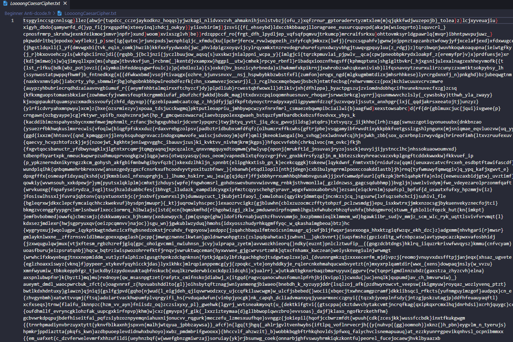
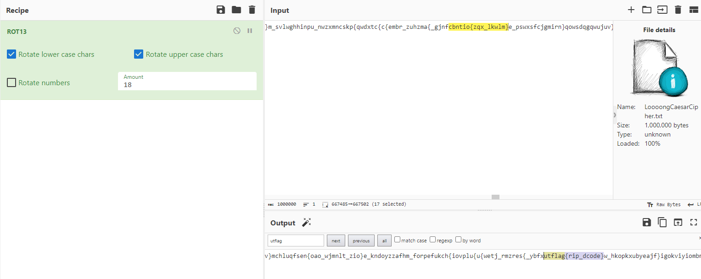

# Beginner: Anti-dcode.fr

> I've heard that everyone just uses dcode.fr to solve all of their crypto problems. Shameful, really.
> 
> This is really just a basic Caesar cipher, with a few extra random characters on either side of the flag. Dcode can handle that, right? >:)
> 
> The '{', '}', and '_' characters aren't part of the Caesar cipher, just a-z. As a reminder, all flags start with "utflag{".
> 
> By Khael (Malfuncti0nal on Discord).

Solution:

We are given with a file: `LoooongCaesarCipher.txt`

It is indeed loooooong.

After doing a trial and error using Cyberchef, I was able to find the flag using a rotation amount of 18.

Flag: `utflag{rip_dcode}`