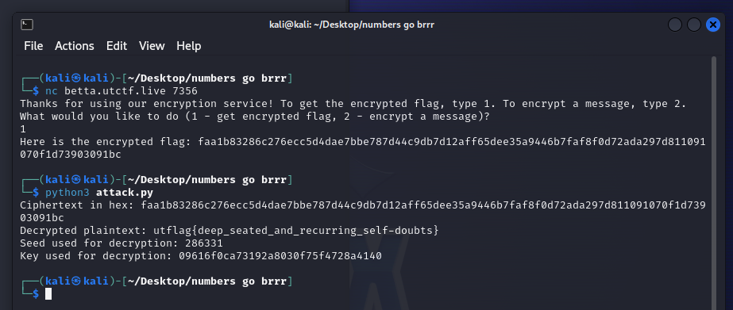

# numbers go brrr

> I wrote an amazing encryption service. It is definitely flawless, so I'll encrypt the flag and give it to you.
> 
> By jocelyn (@jocelyn3270 on discord)
> 
> nc betta.utctf.live 7356

Solution:

We are given with a python script: `main.py`

```python
#!/usr/bin/env python3
from Crypto.Cipher import AES
from Crypto.Util.Padding import pad
from Crypto.Random import random

seed = random.randint(0, 10 ** 6)
def get_random_number():
    global seed 
    seed = int(str(seed * seed).zfill(12)[3:9])
    return seed

def encrypt(message):
    key = b''
    for i in range(8):
        key += (get_random_number() % (2 ** 16)).to_bytes(2, 'big')
    cipher = AES.new(key, AES.MODE_ECB)
    ciphertext = cipher.encrypt(pad(message, AES.block_size))
    return ciphertext.hex()

print("Thanks for using our encryption service! To get the encrypted flag, type 1. To encrypt a message, type 2.")
while True:
    print("What would you like to do (1 - get encrypted flag, 2 - encrypt a message)?")
    user_input = int(input())
    if(user_input == 1):
        break

    print("What is your message?")
    message = input()
    print("Here is your encrypted message:", encrypt(message.encode()))


flag = open('/src/flag.txt', 'r').read();
print("Here is the encrypted flag:", encrypt(flag.encode()))
```

The encryption challenge provided uses a predictable pseudorandom number generator (PRNG) for generating the encryption key. 

The key is generated from a seed value that is squared and then manipulated to produce new numbers. Since the seed value is limited to the range `[0, 10^6]`, there are only a million possible seeds. This allows for a brute force attack by trying all possible seed values to generate the key and attempting to decrypt the ciphertext.

```python
from Crypto.Cipher import AES
from Crypto.Util.Padding import unpad
import binascii

ciphertextHex = input('Ciphertext in hex: ')
ciphertext = binascii.unhexlify(ciphertextHex)

# The original encrypt function for reference
def getRandomNumber(seed):
    seed = int(str(seed * seed).zfill(12)[3:9])
    return seed

# Function to generate a key based on a seed
def generateKey(seed):
    key = b''
    for _ in range(8):
        seed = getRandomNumber(seed)
        key += (seed % (2 ** 16)).to_bytes(2, 'big')
    return key

# Brute force attack to find the correct seed and decrypt the message
def decrypt(ciphertext):
    for seed in range(10**6):
        key = generateKey(seed)
        cipher = AES.new(key, AES.MODE_ECB)
        try:
            plaintext = unpad(cipher.decrypt(ciphertext), AES.block_size)
            # Assuming the plaintext is readable text, let's check for readable characters
            if all(32 <= b <= 126 for b in plaintext):
                return plaintext.decode('utf-8'), seed, key
        except ValueError:
            # This exception occurs when unpadding fails, indicating incorrect decryption
            continue
    return None, None

plaintext, seed, key = decrypt(ciphertext)
if plaintext:
    print(f"Decrypted plaintext: {plaintext}")
    print(f"Seed used for decryption: {seed}")
    print(f"Key used for decryption: {key.hex()}")
else:
    print("Failed to decrypt the ciphertext.")
```

Now let's connect to the challenge server using the provided netcat command and retrieve the ciphertext.



`faa1b83286c276ecc5d4dae7bbe787d44c9db7d12aff65dee35a9446b7faf8f0d72ada297d811091070f1d73903091bc`

Flag: `utflag{deep_seated_and_recurring_self-doubts}`