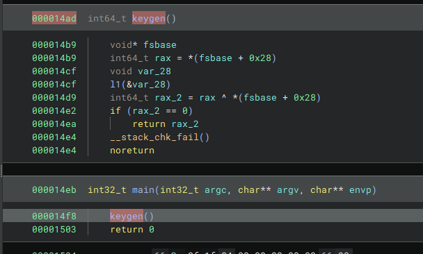
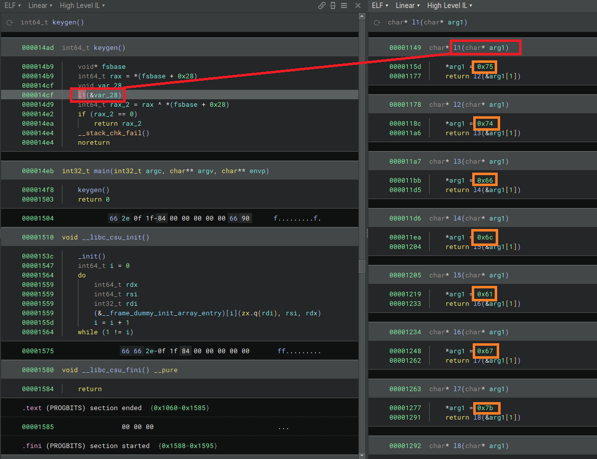
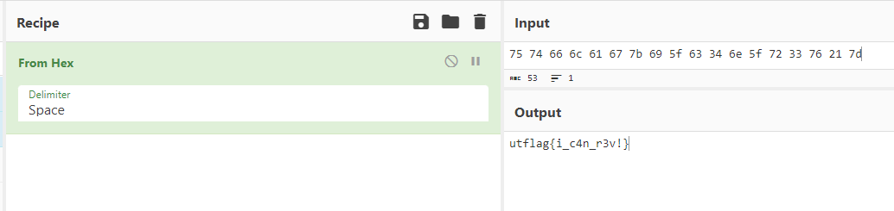

# Beginner Basic Reversing Problem

> So many function calls... but are they that different?
> 
> By Khael (@malfuncti0nal on discord)

Solution:

Checking the entry point, we can see that it calls the `keygen()` function

Inside `keygen()`, it calls another function `l1()`

Looking at the values, it seems they are hex encoded characters

`75 74 66 6c 61 67 7b 69 5f 63 34 6e 5f 72 33 76 21 7d`

Decoding it gives us the flag

Flag: `utflag{i_c4n_r3v!}`