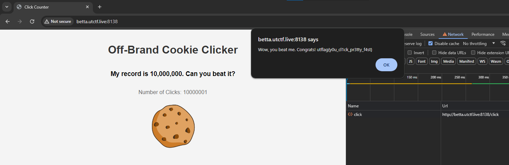

# Beginner: Off-Brand Cookie Clicker

> I tried to make my own version of cookie clicker, without all of the extra fluff. Can you beat my highscore?
> 
> By Khael (@malfuncti0nal on discord)
> 
> http://betta.utctf.live:8138

Solution:

No source file(s) were given. Let's visit the challenge link.

Based on the challenge webpage, we must reach greater than 10,000,000 clicks to get the flag. It retrieves the count via the localStorage, so we can easily manipulate it.

Once we're done editing it, let's refresh the page to reflect the changes and click once to get the flag.

Flag: `utflag{y0u_cl1ck_pr3tty_f4st}`